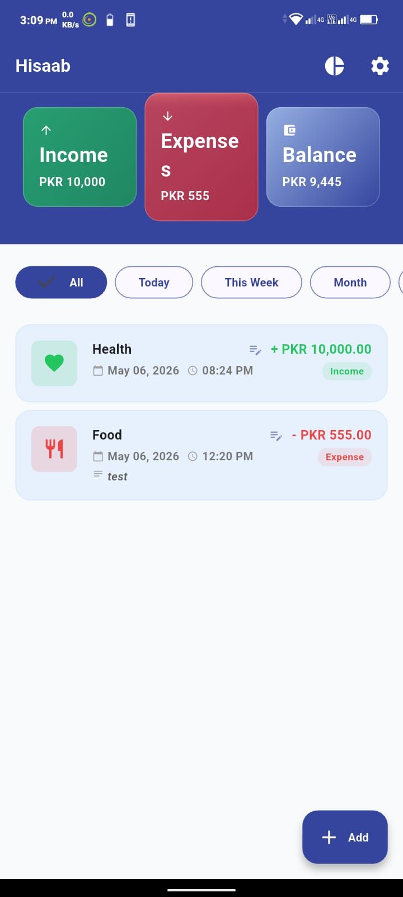
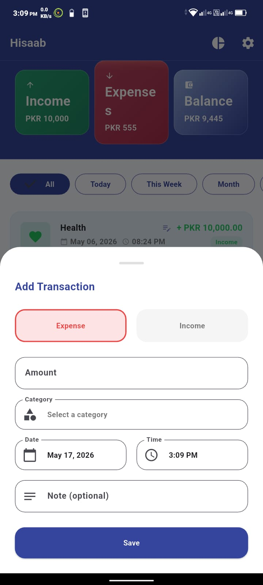
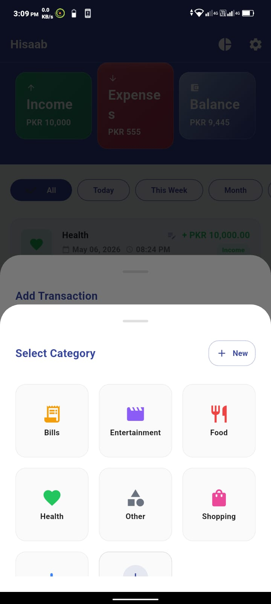
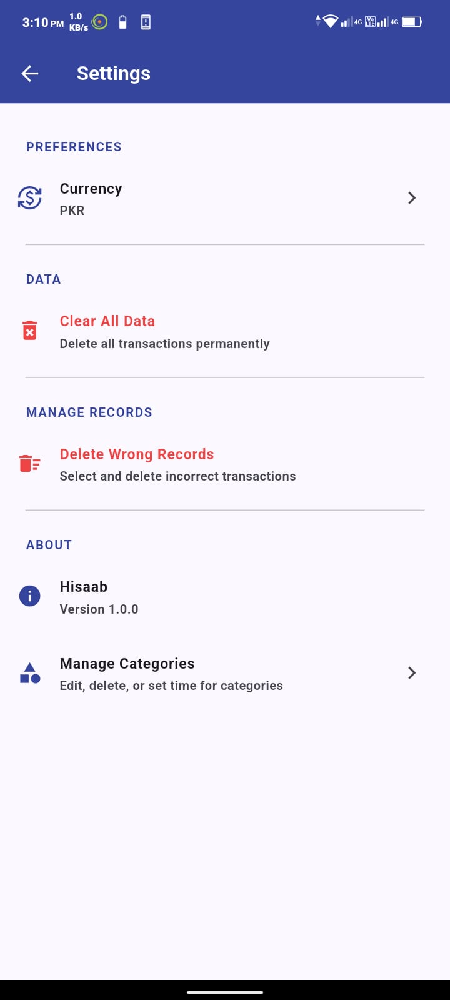
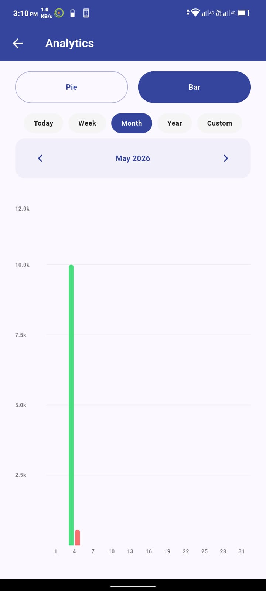
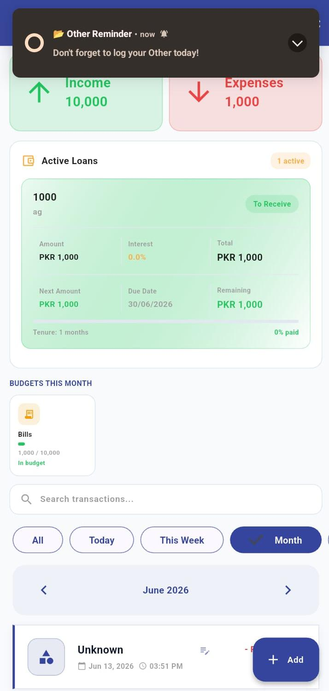

# 💰 Hisaab - Personal Expense Tracker

A beautiful, offline-first personal finance manager built with **Flutter** and **Hive**. Track daily expenses, income, loans, and get smart reminders — all stored locally on your device.

---

## ✨ Features

### 📊 Transaction Management
- **Add/Edit Transactions** with amount, category, date, time & notes
- **Swipe Actions** on cards: Edit Category | Edit Full | Delete
- **Date Picker** — select past dates up to today (no future dates)
- **Time Picker** — record exact transaction time
- **Income/Expense Toggle** with color-coded visual feedback
- **Multi-select Delete** for bulk removing wrong records

### 🏦 Loan Management *(New)*
- **Track Loans Given & Received** with person name and loan title
- **Interest Rate & Tenure** — set monthly EMI with auto-calculation
- **Payment Ledger** — installment-by-installment tracking table
- **Actual vs Expected EMI** — record partial or full payments
- **Live Balance Recalculation** — remaining balance updates in real time
- **Settled Status** — loan auto-marks settled when balance reaches zero
- **Partial Payment Indicator** — orange highlight for partial payments

### 🔔 Smart Notifications *(New)*
- **Daily Category Reminders** — set a time per category, get notified every day
- **Monthly Loan Reminders** — notified on payment due day each month
- **Works When App is Closed** — uses exact alarms via `flutter_local_notifications`
- **Auto-reschedule** — reminder shifts to next unpaid installment after each payment
- **Cancel on Settle** — loan notifications auto-cancel when fully paid
- **Custom Reminder Time** — change reminder time anytime from loan screen

### 🏷️ Custom Categories
- **10+ Built-in Icons** — restaurant, shopping, transport, health, etc.
- **Create Custom Categories** with your own name, color & icon
- **"Other" Option** in picker to instantly add new categories
- **Category Management Screen** — edit names, set reminder times, delete unused
- **Usage Protection** — categories used in transactions can't be deleted

### 🎨 Beautiful UI
- **Dark & Light Mode** *(New)* — full theme support across all screens
- **Glassmorphism Cards** with backdrop blur effect
- **Color-coded Categories** — each category has its own accent color
- **Slidable List Items** with edit/delete/category-change actions
- **Bottom Sheet Pickers** for smooth category & date selection

### ⚙️ Settings & Data
- **Multi-Currency Support** *(New)* — PKR, USD, EUR, GBP, AED, SAR, INR
- **Currency Symbol** updates live across all screens
- **Clear All Data** — one-tap wipe with confirmation
- **Offline Storage** — all data persists locally via Hive, no internet needed

---

## 🛠️ Tech Stack

| Technology | Purpose |
|---|---|
| **Flutter** | UI Framework |
| **Hive** | Local NoSQL Database |
| **flutter_local_notifications** | Scheduled & recurring notifications |
| **timezone** | Accurate time zone handling for alarms |
| **flutter_slidable** | Swipe actions on cards |
| **flutter_colorpicker** | Custom category color selection |
| **intl** | Date/Time & currency formatting |
| **uuid** | Unique transaction & loan IDs |

---

## 📁 Project Structure

```
lib/
├── core/
│   └── constants/
│       ├── app_colors.dart          # Brand colors & gradients
│       ├── app_spacing.dart         # Unified spacing scale
│       └── app_text_styles.dart     # Typography system
├── data/
│   ├── models/
│   │   ├── transaction_model.dart   # Hive transaction entity
│   │   ├── category_model.dart      # Hive category entity
│   │   └── loan_payment_record.dart # Loan installment record
│   └── services/
│       ├── transaction_service.dart # CRUD operations
│       └── notification_service.dart # Schedule/cancel notifications
├── presentation/
│   ├── screens/
│   │   ├── home_screen.dart                   # Dashboard & transaction list
│   │   ├── settings_screen.dart               # Currency, theme, clear data
│   │   ├── category_management_screen.dart    # Edit/delete/remind categories
│   │   └── loan_management_screen.dart        # EMI ledger & payment tracking
│   └── widgets/
│       ├── add_transaction_sheet.dart         # Bottom sheet form
│       ├── category_grid_picker.dart          # Category selector + custom add
│       └── transaction_card.dart              # Glassmorphism list item
└── main.dart
```

---

## 📱 Screenshots

| Home | Add Transaction | Categories |
|------|----------------|------------|
|  |  |  |

| Settings | Chart | Loan Ledger |
|----------|-------|-------------|
|  |  |  |

---

## 🎬 Demo Videos

| Platform | Link |
|----------|------|
| 🌐 Web | [Watch on Drive](https://drive.google.com/file/d/1SXwATIq5bNWSKXMHLug0t6WE0Ms7SpgM/view?usp=drive_link) |
| 📱 Mobile | [Watch on Drive](https://drive.google.com/file/d/1Xe_2C-p3iQz6r_zV4Nh1mJO_x5JkycwV/view?usp=drive_link) |

---

